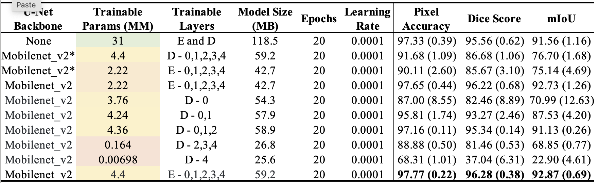
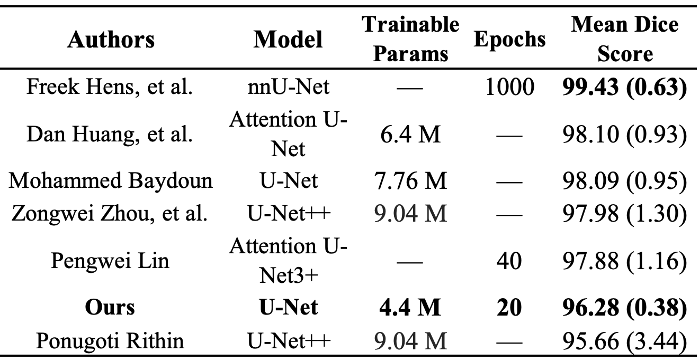

# FT_Methods_for_Fetal_Head_Segmentation

This repo is a **PyTorch** implementation of experimenting seven fine-tuning (FT) strategies for fetal head ultrasound image **segmentation** tasks. Our experiments utilize a **U-Net** model with pre-trained **Mobilenet V2**.

The dataset used for the project was taken from the <a href="https://hc18.grand-challenge.org/">HC18</a> challenge.

## U-Net 
The U-Net implemented is shown in the figure below:

The encoder is a MobileNet model pre-trained on ImageNet. MobileNet is a deep CNN model developed primarily for the operation of mobile and embedded vision applications. It employs a simplified architecture that makes use of depth-wise separable convolutions, enabling the construction of lightweight deep neural networks with less computational cost, reduced memory, and less power consumption. The MobileNet V2 implemented is shown in the figure below:

The summary of the model is as following:

## Problem Statement
The problem statement of the <a href="https://hc18.grand-challenge.org/">HC18</a> challenge was to model the head of the fetus as an **ellipse**. The approach employed to solve the problem was to **segment** the **fetal head** followed by using **Hough transform** to fit the ellipse. The **Unet** model was trained to segment the ultrasound images and ellipse fitting was performed using the **OpenCV** implementation of **Hough transforms**.

Training a deep convolutional neural network (CNN) from scratch is challenging, especially in medical applications where annotated data are limited and require significant time investment. **Transfer learning (TF)** is a technique where a network learns from a large data set and then applies that knowledge to another application, typically a small data set. TF approaches involve the adoption of pre-trained models and **fine-tuning (FT)**. Fetal head segmentation is an essential step in measuring the **fetal head circumference (HC)**, a crucial medical biometry in obstetrics used to monitor fetal growth during gestation. Utilizing CNN models has improved the efficiency of medical biometry, which otherwise would require significant human effort and may result in inconsistent accuracy.

The results are as follows:
Our methodology yielded an exceptional Pixel Accuracy of **97.94%**, a mIoU of **93.42%**, and a Dice coefficient of **96.60%** for the HC18 test dataset in just **20 epochs**.

Comparison of our methods with the SOTA methods.

### Methodology

  

  <figure>
    
  </figure>

### Segmentation Results

| Table 2| Table 3 |
--- | --- 
 | 

  <figure>
    
    <figcaption> From left to right (a) the original images, (b) the ground truth masks, (c) the predicted masks with our fine-tunned model, (d) the predicted masks by the U-Net baseline model. </figcaption>
  </figure>

## References
- O. Ronneberger, P. Fischer, and T. Brox. U-net: Convolutional networks for biomedical image segmentation. CoRR, abs/1505.04597, 2015.
- Mark Sandler, Andrew G. Howard, Menglong Zhu, Andrey Zhmoginov, & Liang-Chieh Chen (2018). Inverted Residuals and Linear Bottlenecks: Mobile Networks for Classification, Detection and Segmentation. CoRR, abs/1801.04381.
- Thomas L. A. van den Heuvel, Dagmar de Bruijn, Chris L. de Korte, & Bram van Ginneken. (2018). Automated measurement of fetal head circumference using 2D ultrasound images [Data set]. Zenodo. https://doi.org/10.5281/zenodo.1327317.
- Isensee, F., Jaeger, P. F., Kohl, S. A., Petersen, J., & Maier-Hein, K. H. (2021). nnU-Net: a self-configuring method for deep learning-based biomedical image segmentation. Nature methods, 18(2), 203-211.
- Olga Russakovsky*, Jia Deng*, Hao Su, Jonathan Krause, Sanjeev Satheesh, Sean Ma, Zhiheng Huang, Andrej Karpathy, Aditya Khosla, Michael Bernstein, Alexander C. Berg and Li Fei-Fei. (* = equal contribution) ImageNet Large Scale Visual Recognition Challenge. IJCV, 2015.
